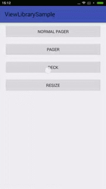

## ViewLibrary(RecyclerView's LayoutManager) is available on <https://github.com/qbcbyb/Hydrant-Lib/tree/master/viewlibrary>
view sample in ViewLibrarySample<https://github.com/qbcbyb/Hydrant-Lib/tree/master/viewlibrarysample>
or videos below:

- ### Normal-Pager


- ### Pager


- ### Deck


- ### Resize


- ### USAGE:  
Only snapshot version available on oss.snapshot.org now,
please add <https://oss.sonatype.org/content/repositories/snapshots/> in your config
just like add below in your build.gradle:
```
allprojects {
    repositories {
        jcenter()
        maven { url "https://oss.sonatype.org/content/repositories/snapshots/"}
    }
}
```
and then you can add below to your dependencies:
> compile 'com.github.qbcbyb:viewlibrary:1.0.15-SNAPSHOT

## provider: a simple ContentProvider implement,<https://github.com/qbcbyb/Hydrant-Lib/tree/master/provider>
### USAGE:
1. Please add <https://oss.sonatype.org/content/repositories/snapshots/> in your config like above.  
then add below to your dependencies: 
    > compile 'com.github.qbcbyb:provider:1.0.15-SNAPSHOT
2. Download Templates in <https://github.com/qbcbyb/Hydrant-Lib/tree/master/provider/File-and-Code-Templates> ,then add them to your AndroidStudio's "File and Code Templates"
3. Create bean use template `TableModel` and create tableColumn use template `TableColumn`, all of them mush use the same Name while creating;
4. Now you can add your field to your bean ,don't forget to implement field's getter and setter in your tableColumn, view `Conversation` and `ConversationTableColumn` sample in <https://github.com/qbcbyb/Hydrant-Lib/tree/master/provider/src/test/java/com/github/qbcbyb/provider/test>;
5. Add your table single instance into `Tables` list like <https://github.com/qbcbyb/Hydrant-Lib/tree/master/provider/src/test/java/com/github/qbcbyb/provider/test/Tables.java>;
6. Add your ContentProvider and SQLiteOpenHelper like `TestContentProvider` and `TestSQLiteOpenHelper` in <https://github.com/qbcbyb/Hydrant-Lib/tree/master/provider/src/test/java/com/github/qbcbyb/provider/test/>;
7. Add `TestContentProvider` in your AndroidManifest.xml;
8. Once you need add new Table, you need repeat step 3、4、5 , and config UpgradeAction in `TestSQLiteOpenHelper`.

## ImageCrop
    
is a copy of "https://github.com/jdamcd/android-crop"  
using for image crop

## androidtimessquareidle_wulib
    
日历展示库 已经忘了引用源是哪了~  

## ~~library(do not recommand)~~  the main library

dependencies(with out //)
> compile 'com.github.flavienlaurent.datetimepicker:library:0.0.2'  //日期选择控件  
//    compile 'com.squareup.okhttp:okhttp-urlconnection:2.0.0-RC1'  
//    compile 'com.squareup.okhttp:okhttp:1.5.4'  
//    compile 'com.squareup.picasso:picasso:2.3.2@jar'  
compile 'com.nostra13.universalimageloader:universal-image-loader:1.9.2'  //优化图片加载的库  
//    compile 'com.koushikdutta.urlimageviewhelper:urlimageviewhelper:1.0.4'  
compile 'com.nineoldandroids:library:2.4.0'     //动画兼容库  
compile 'com.alibaba:fastjson:1.1.41@jar'       //json解析库  
//    compile 'com.jakewharton:disklrucache:2.0.2'  
//    compile 'com.jakewharton:butterknife:5.1.1@jar'  
//    compile 'com.github.chrisbanes.photoview:library:1.2.3'  
//    compile 'com.astuetz:pagerslidingtabstrip:1.0.1'  


used(想查看原始代码的可以根据包名去百度，基本都是在github)
> com.alexvasilkov.foldablelayout (flipbroad效果的库)  
com.ryg.expandable.ui (可将group固定在顶部的ExpandableListView)  
com.woozzu.android.widget (联系人中右侧快速字母定位的实现库)  
in.srain.cube.views (带HeaderView、FooterView的GridView)  
org.askerov.dynamicgrid (可拖动排序的GirdView)  
uk.co.senab.photoview (可放大缩小的图片查看库)  

    

## ~~PullToRefresh~~
is a copy of [Android-PullToRefresh](https://github.com/chrisbanes/Android-PullToRefresh)  
add StaggeredGridView(瀑布流) from [StaggeredGridView](https://github.com/maurycyw/StaggeredGridView)  
add PullToRefreshStaggeredGridView from opensource

## ~~QiNiu~~
use `compile 'com.qiniu:qiniu-android-sdk:7.2.0'` instead

## ~~tecentweibo~~
    
引用组件库